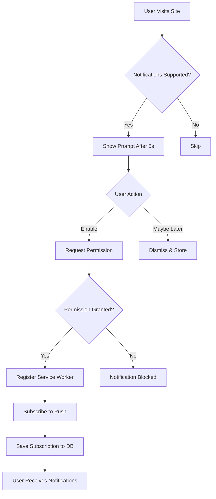

# Push Notifications Implementation Guide

## Overview

Smarty Gym now supports browser push notifications across all major platforms:
- ✅ Chrome (Desktop & Mobile)
- ✅ Firefox (Desktop & Mobile)
- ✅ Safari (Desktop & iOS 16.4+)
- ✅ Edge (Desktop & Mobile)
- ✅ Opera (Desktop & Mobile)

## How It Works

### For Users

1. **Opt-In Prompt**: When users visit the site, they'll see a notification prompt after 5 seconds
2. **Enable Notifications**: Users click "Enable Notifications" to grant permission
3. **Instant Alerts**: Users receive push notifications for:
   - New messages from admin
   - Responses to their contact requests
   - System updates (if enabled)

### For Admin

1. **Automatic Notifications**: Admin receives notifications when:
   - New contact message arrives (real-time)
   - New user signs up
   - New purchase is made
   - New personal training request

2. **Manual Notifications**: Admin can send push notifications from:
   - Contact Manager (when responding to messages)
   - Mass Notification Manager (bulk notifications)

## User Experience Flow



## Technical Implementation

### Service Worker (`public/service-worker.js`)
- Handles push events from the browser
- Displays notifications
- Handles notification clicks
- Manages notification lifecycle

### Push Notification Component (`src/components/PushNotificationSetup.tsx`)
- Requests notification permission
- Registers service worker
- Subscribes to push notifications
- Saves subscription to database
- Manages subscription status

### Notification Utilities (`src/utils/notificationUtils.ts`)
- Helper functions for notification management
- Service worker registration
- Permission checking
- Test notification sending

### Backend Function (`supabase/functions/send-push-notification/index.ts`)
- Fetches active subscriptions from database
- Sends push notifications to target users
- Supports single user or multiple users
- Handles notification delivery status

## Database Schema

### push_subscriptions Table
```sql
- id: UUID (primary key)
- user_id: UUID (references auth.users)
- subscription_data: JSONB (push subscription object)
- device_type: TEXT (ios/android/desktop)
- browser_info: TEXT (user agent)
- is_active: BOOLEAN (subscription status)
- created_at: TIMESTAMP
- updated_at: TIMESTAMP
```

### profiles.notification_preferences
```json
{
  "email": true,
  "push": true,
  "new_messages": true,
  "admin_responses": true,
  "system_updates": false
}
```

## User Settings

Users can manage notifications in **Profile Settings > Notifications**:
- Enable/Disable browser push notifications
- Toggle specific notification types
- View notification permission status

## Admin Usage

### Responding to Messages
When admin responds to a user message in Contact Manager:
1. Response is saved to database
2. Email notification is sent (if user has email)
3. Push notification is sent (if user enabled push)
4. User sees notification instantly

### Sending Manual Notifications
Admin can send notifications from Mass Notification Manager:
- Select target audience (all users, subscribers, premium)
- Compose message
- Send to all selected users
- Notifications delivered via push + email

## Browser Compatibility

| Browser | Desktop | Mobile | Min Version |
|---------|---------|--------|-------------|
| Chrome | ✅ | ✅ | 50+ |
| Firefox | ✅ | ✅ | 44+ |
| Safari | ✅ | ✅ | 16.4+ (iOS) |
| Edge | ✅ | ✅ | 17+ |
| Opera | ✅ | ✅ | 37+ |

## Permission States

1. **Default**: User hasn't been asked yet
2. **Granted**: User has enabled notifications
3. **Denied**: User has blocked notifications
   - User must enable in browser settings manually

## Testing Notifications

### Test as User
1. Visit the site
2. Click "Enable Notifications" when prompted
3. Grant permission in browser
4. Go to Profile Settings > Notifications
5. Verify "Notifications are enabled" message

### Test as Admin
1. Log in as admin
2. Go to Contact Manager
3. View a user message
4. Send a response
5. User should receive push notification (if online and enabled)

## Important Notes

### Limitations
- **iOS Safari**: Push notifications only work on iOS 16.4+
- **Private/Incognito Mode**: Some browsers block notifications
- **Battery Saver**: May delay or block notifications
- **Do Not Disturb**: System settings override app notifications

### Privacy
- Users can disable notifications anytime
- Subscriptions are stored securely
- Only active subscriptions receive notifications
- Users control what types of notifications they receive

### Production Considerations

**IMPORTANT**: The current implementation uses a dummy VAPID key for development. For production:

1. **Generate VAPID Keys**:
   ```bash
   npx web-push generate-vapid-keys
   ```

2. **Store Keys Securely**:
   - Add VAPID public key to `PushNotificationSetup.tsx`
   - Add VAPID private key to backend secrets
   - Never commit keys to version control

3. **Install web-push Library** (for production):
   ```bash
   npm install web-push
   ```

4. **Update Edge Function**:
   Use web-push library to actually send notifications:
   ```typescript
   import webpush from 'web-push';
   
   webpush.setVapidDetails(
     'mailto:your-email@example.com',
     publicVapidKey,
     privateVapidKey
   );
   
   await webpush.sendNotification(
     subscriptionData,
     JSON.stringify(payload)
   );
   ```

## Notification Best Practices

1. **Don't Spam**: Only send important, actionable notifications
2. **Be Clear**: Use descriptive titles and bodies
3. **Add Actions**: Include URL for users to take action
4. **Respect Preferences**: Honor user notification settings
5. **Test Thoroughly**: Test on multiple browsers and devices

## Troubleshooting

### Notifications Not Showing
- Check if permission is granted
- Verify service worker is registered
- Check browser console for errors
- Ensure notifications are enabled in system settings

### Subscription Failed
- Check if HTTPS is enabled (required for push)
- Verify VAPID keys are correct (production)
- Check browser compatibility
- Review service worker registration

### Admin Not Receiving Notifications
- Ensure admin has enabled notifications
- Check if contact_messages table has real-time enabled
- Verify admin is subscribed to push notifications
- Check browser permissions

## Future Enhancements

Potential improvements:
- Action buttons in notifications (Reply, View, Dismiss)
- Rich notifications with images
- Notification scheduling
- Notification history/log
- A/B testing for notification content
- Push notification analytics
